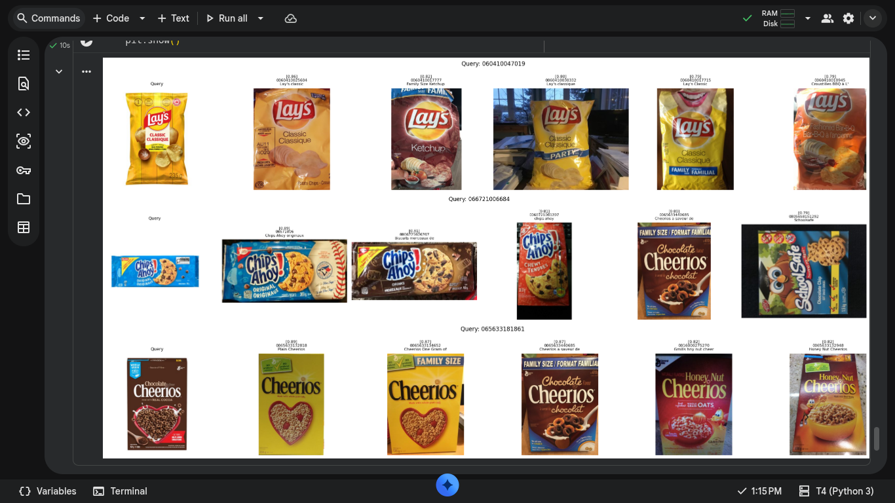
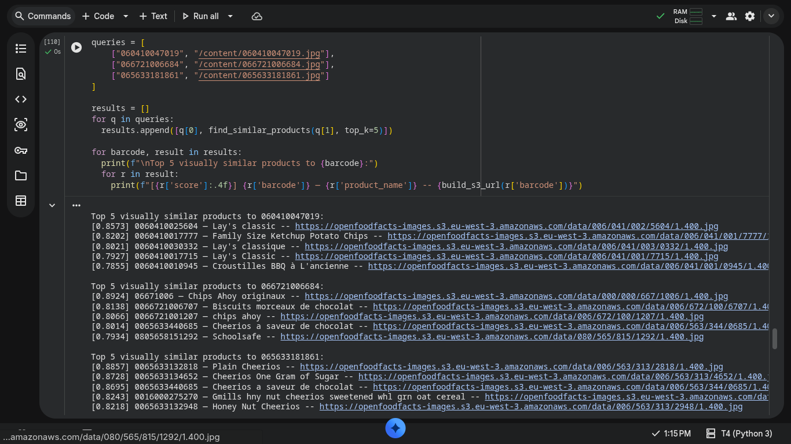

# Colab Notebooks

1. [FTS vs Fuzzy OFF DB](https://colab.research.google.com/drive/1XRTl4adTmOJQMk68uIGsdtmF_KAxcozH?usp=sharing) - Experiment comparing FTS vs Fuzzy matching on OFF database
2. [Semantic Search with Sentence Transformers](https://colab.research.google.com/drive/1YWbDePzX8NoD0KA4ZuWutmNpiZCv34s9?usp=sharing) - Experiment using Sentence Transformers for semantic search
3. [Semantic Search with CLIP](https://colab.research.google.com/drive/1cq9oAlOjm-gUC3Z_LSKMCfVdl2zNF2v7?usp=sharing) - Experiment using CLIP for semantic search

# Disclosure Notice

I am not an AI/ML expert, and these notebooks do not claim to be production-grade ML work.

These experiments were built to explore potential solutions for the problem when a product's barcode is missing or unscannable on a retailer's page. The hypothesis across all three was to find a reliable fallback that can still surface the right product and its nutritional data without a barcode.

To execute these ideas within the tight GSoC 2026 window, I used Claude Chat to help generate code snippets faster. The research direction, architecture decisions, matching strategies, and the problem framing are my own. Claude assisted with translating those ideas into working code, acting as a coding accelerator, not a replacement for the thinking behind the experiments.

I am fully aware these are early-stage experiments, not polished implementations. If any of these approaches are considered a viable direction for the project, I am happy to go deeper and learn whatever is needed to refine the implementation and integrate it properly into the Project.

# Demo

## Semantic Search with CLIP

