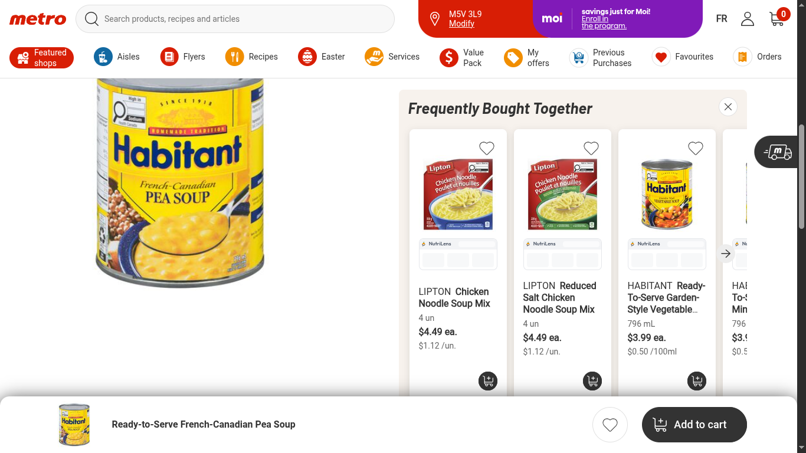
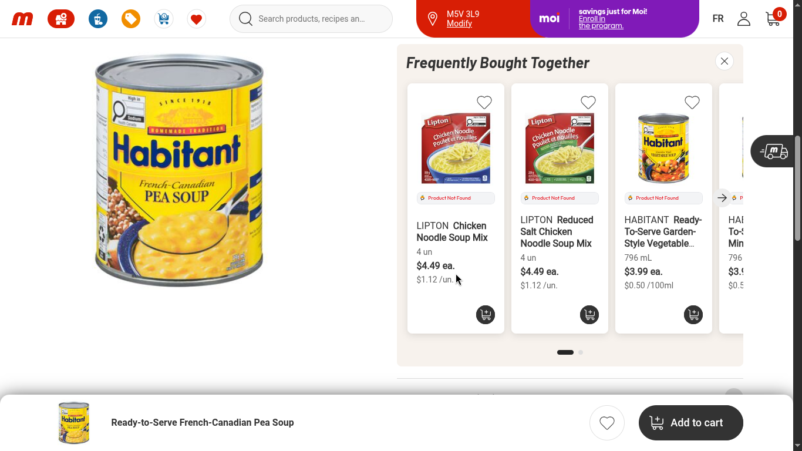
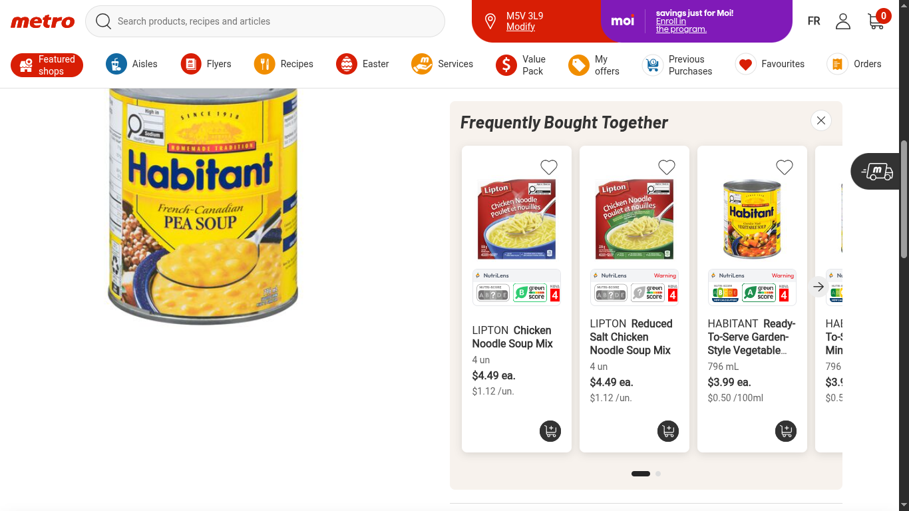
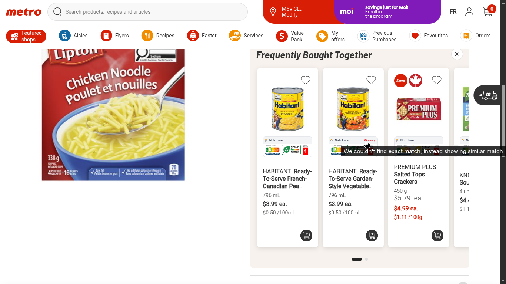
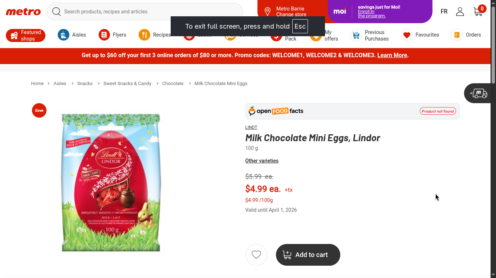
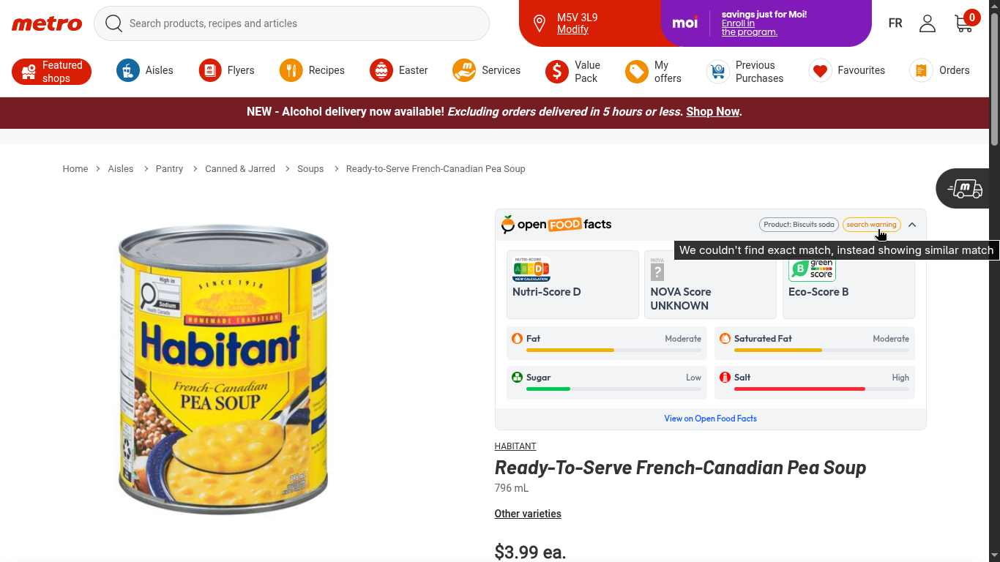
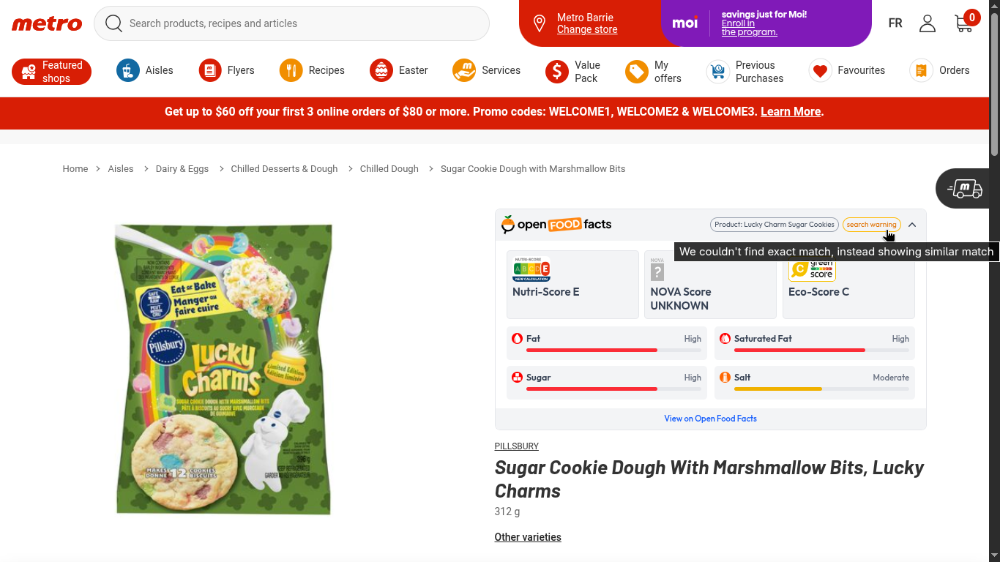
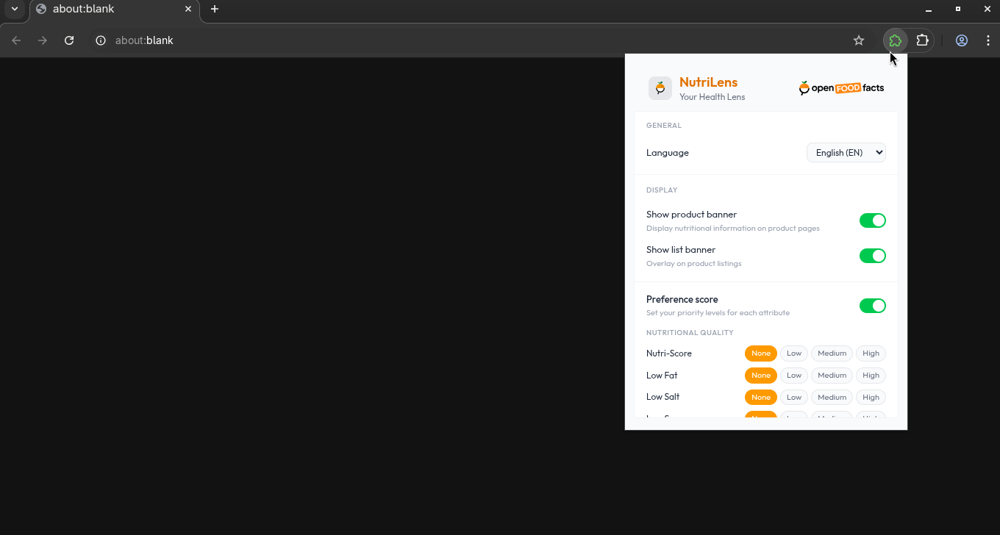
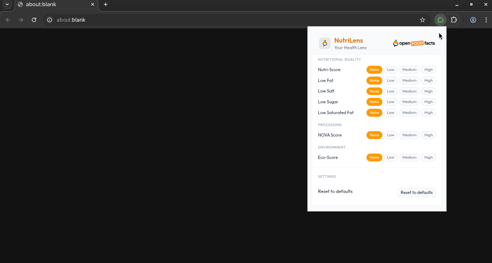

# OFF P5 Prototype - GSoC 2026

A collection of prototypes for Open Food Facts Project #5 (Online Grocery Extension) - Google Summer of Code 2026.

## Repositories

- **[NutriLens](./NutriLens/)** - Browser extension that overlays Open Food Facts nutritional data (Nutri-Score, NOVA, Eco-Score) onto grocery websites. Currently supports metro.ca with an extensible adapter system.

- **[DuckDB Server](./duckdb-server/)** - Flask API with DuckDB backend for managing product-store mappings, lookups, and store information.

- **[Preference Score Calculator](./preference-score-calculator/)** - Web app that calculates preference scores for food products based on nutritional quality, processing level, and environmental impact.

- **[Request Interceptor](./request-interceptor/)** - WXT-based browser extension that intercepts and logs API calls from websites to understand how grocery sites fetch product data.

- **[Colab Python Experiments](./colab-python-experiments/)** - Python experiments for FTS vs fuzzy search and vector search on Open Food Facts database.

# Demo Videos

## NutriLens Demo
<video src="demos/videos/nutrilens-demo.mp4" controls></video>

## DuckDB Server Demo
<video src="demos/videos/duckdb-server-demo.mp4" controls></video>

## Preference Score Demo
<video src="demos/videos/preference-score-demo.mp4" controls></video>

## Request Interceptor Demo
<video src="demos/videos/request-interceptor-demo.mp4" controls></video>

## Additional Screenshots

### List Banner Loading

### List Banner Not Found

### List Banner Results

### List Banner Search Warning

### Product Banner Not Found

### Product Banner Search Warning 1

### Product Banner Search Warning 2

### Popup Window UI 1

### Popup Window UI 2
